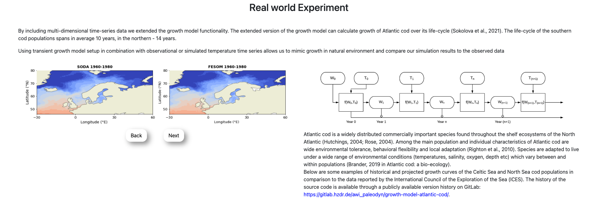
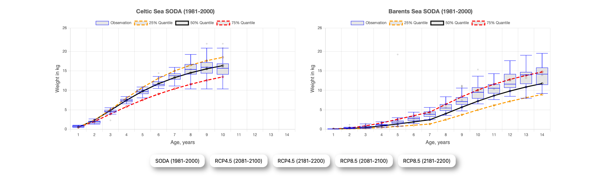
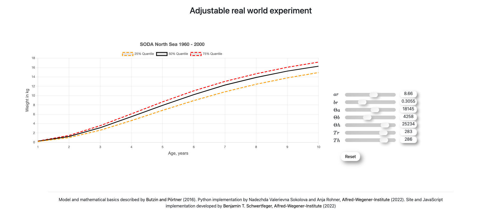

# The Atlantic Cod Growth Model (website)

| Project             | URL                                                                     |
| ------------------- | ----------------------------------------------------------------------- |
| Interactive Website | https://btschwertfeger.github.io/Growth-Model-Website/                  |
| GitLab Project      | https://codebase.helmholtz.cloud/awi_paleodyn/growth-model-atlantic-cod |

---

## 📍 About the Project

Growth, development and progress are the fundamental processes of life.

This website was developed to support the [project](https://codebase.helmholtz.cloud/awi_paleodyn/growth-model-atlantic-cod) of Nadezhda Sokolova, which thematizes a growth model for the altantic cod. It provides general information about the model as well as dynamic and customizable diagrams to experiment with the input parameters of a simplified growth model and serves as supporting material for knowledge transfer and research.

### Content

In the first section, a "real world" experiment is in the foreground, in which the working method of this growth model is shown. Here, the data were calculated in advance within the framework of the work, since this would go beyond the scope of a static website.

Nevertheless, different climate scenarios have been chosen for the celtic sea and barents sea.
which can be used to read off the growth rates of the altantic code.

The last section offers the possibility to run the growth model with different parameters. The results of the parameter changes can be followed live and offer interested parties the possibility to investigate the effects of different conditions.

This website was developed as part of [Benjamin T. Schwertfeger](https://b-schwertfeger.de)'s work at the [Alfred Wegener Institute](https://www.awi.de) and serves as supporting material for knowledge transfer and research.

---

## 📍 Availability

This website is available at the website of the Alfred-Wegener-Insitute (see [Growth_Model.html](https://www.awi.de/fileadmin/user_upload/AWI/Forschung/Klimawissenschaft/Dynamik_des_Palaeoklimas/Growth_Model)). The latest version is available the github pages feature of thie repositoriy (see [github.io/Growth-Model-Website/](https://btschwertfeger.github.io/Growth-Model-Website)).

---

## 🏛️ Licenses

| Purpose             | License   | Includes                                                    |
| ------------------- | --------- | ----------------------------------------------------------- |
| Code license        | GNU GPLv3 | All code parts of this project.                             |
| Referencing license | CC-BY-4.0 | Text and images of the rendered website and this README.md. |

---

## 🔬 References

- Audzijonyte A., Richards S.A., Stuart-Smith R.D., Pecl G., Edgar G.J., Barrett N.S., Payne N., Blanchard J.L., 2020. Fish body sizes change with temperature, but not all species shrink with warming. Nature Ecology and Evolution 4 (6), 809-814 https://doi.org/10.1038/s41559-020-1171-0
- Björnsson, B., Steinarsson, A., 2002. The food-unlimited growth rate of Atlantic cod (Gadus morhua). Can. J. Fish. Aquat. Sci. 59, 494–502. https://doi.org/10.1139/f02-028
- Björnsson, B., Steinarsson, A., Árnason, T., 2007. Growth model for Atlantic cod (Gadus morhua): Effects of temperature and body weight on growth rate. Aquaculture 271, 216–226. https://doi.org/10.1016/j.aquaculture.2007.06.026
- Brown, J.H., Gillooly, J.F., Allen, A.P., Savage, V.M., West, G.B., 2004. Toward a metabolic theory of ecology. Ecology 85, 1771–1789. https://doi.org/10.1890/03-9000
- Campbell, N.A., Reece, J.B., Urry, L.A., Cain, M.L., Wasserman, S.A., Minorsky, P.V., Jackson, R., 2008. Biology. Pearson, Benjamin Cummings, San Francisco.
- Chamber, R.C., Trippel, E.A. (Eds.), 1997. Early Life History and Recruitment in Fish Populations, Fish & Fisheries Series. Springer.
- Clarke, A., 2017. Principles of Thermal Ecology: Temperature, Energy, and Life. Oxford University Press. https://doi.org/10.1093/oso/9780199551668.001.0001
- Drinkwater, K.F., 2005. The response of Atlantic cod (Gadus morhua) to future climate change. ICES J Mar Sci 62, 1327–1337. https://doi.org/10.1016/j.icesjms.2005.05.015
- Jobling, M., 1988. A Review of the Physiological and Nutritional Energetics of Cod, Gadus morhua L., with Particular Reference to Growth Under Farmed Conditions. Aquaculture 70, 1–19. https://doi.org/10.1016/0044-8486(88)90002-6
- Lorenzen, K., 2016. Toward a new paradigm for growth modeling in fisheries stock assessments: Embracing plasticity and its consequences. Fisheries Research, Growth: theory, estimation, and application in fishery stock assessment models 180, 4–22. https://doi.org/10.1016/j.fishres.2016.01.006
- Pörtner, H.O., Berdal, B., Blust, R., Brix, O., Colosimo, A., De Wachter, B., Giuliani, A., Johansen, T., Fischer, T., Knust, R., Lannig, G., Naevdal, G., Nedenes, A., Nyhammer, G., Sartoris, F.J., Serendero, I., Sirabella, P., Thorkildsen, S., Zakhartsev, M., 2001. Climate induced temperature effects on growth performance, fecundity and recruitment in marine fish: developing a hypothesis for cause and effect relationships in Atlantic cod (Gadus morhua) and common eelpout (Zoarces viviparus). Continental Shelf Research, European Land-Ocean Interaction 21, 1975–1997. https://doi.org/10.1016/S0278-4343(01)00038-3
- Sokolova, 2022. PhD Thesis
- Sokolova, N., Butzin, M., Dahlke, F., Werner, K.-M., Balting, D., Lohmann, G., Pörtner, H.-O. 2021. Exploring the role of temperature in observed inter-population differences of Atlantic cod (Gadus morhua) growth with a 4-dimensional modelling approach, ICES Journal of Marine Science, Volume 78, Issue 4, August 2021, Pages 1519–1529, https://doi.org/10.1093/icesjms/fsab043
- von Bertalanffy, L., 1938. A quantitative theory of organic growth (inquiries on growth laws. II). Human Biology 10, 181–213.
- Weatherley, A.H., 1966. Ecology of fish growth. Nature 212, 1321–1324. https://doi.org/10.1038/2121321a0
- Weatherley, A.H., Gill, H.S., 1987. The biology of fish growth. Academic Press, London.

---
